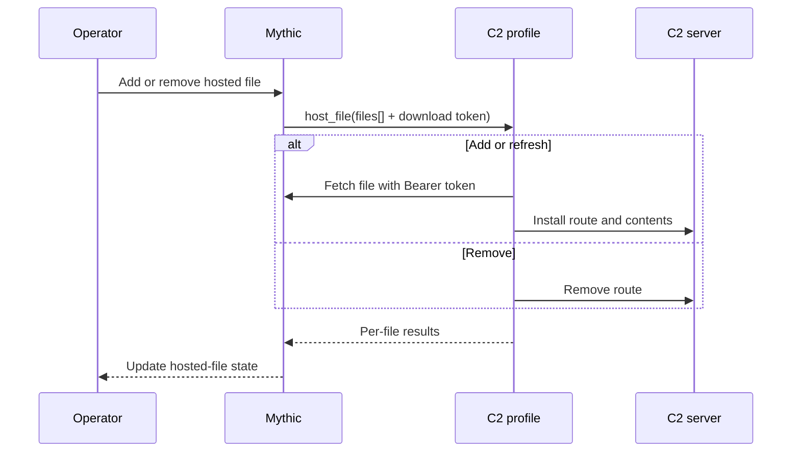

C2 file hosting lets an operator expose a Mythic file or payload at a path handled by a C2 profile. Mythic 4.0 manages these hosted-file records from the UI and sends add/remove batches to the profile's `host_file` function.

## Implement the handler

<Tabs>
  <Tab title="Python">
    ```python
    from mythic_container.C2ProfileBase import (
        C2HostFilesMessage,
        C2HostFilesMessageResponse,
        C2HostFilesMessageResponseFile,
    )

    async def host_file(
        self, input_msg: C2HostFilesMessage
    ) -> C2HostFilesMessageResponse:
        results = []

        for entry in input_msg.Files:
            try:
                if entry.Remove:
                    await self.remove_route(entry.HostURL)
                else:
                    file_bytes = await self.fetch_from_mythic(
                        agent_file_id=entry.AgentFileID,
                        bearer_token=entry.DownloadToken,
                    )
                    await self.install_route(
                        route=entry.HostURL,
                        filename=entry.Filename,
                        contents=file_bytes,
                    )

                results.append(
                    C2HostFilesMessageResponseFile(
                        Success=True,
                        AgentFileID=entry.AgentFileID,
                        HostURL=entry.HostURL,
                    )
                )
            except Exception as exc:
                results.append(
                    C2HostFilesMessageResponseFile(
                        Success=False,
                        Error=str(exc),
                        AgentFileID=entry.AgentFileID,
                        HostURL=entry.HostURL,
                    )
                )

        return C2HostFilesMessageResponse(
            Success=all(result.Success for result in results),
            Results=results,
        )
    ```
  </Tab>

  <Tab title="Golang">
    ```go
    HostFileFunction func(
        context.Context,
        C2HostFilesMessage,
    ) C2HostFilesMessageResponse

    type C2HostFileMessage struct {
        AgentFileID   string `json:"agent_file_id"`
        HostURL       string `json:"host_url"`
        Remove        bool   `json:"remove"`
        DownloadToken string `json:"download_token,omitempty"`
        Filename      string `json:"filename,omitempty"`
    }

    type C2HostFilesMessage struct {
        Name  string              `json:"c2_profile_name"`
        Files []C2HostFileMessage `json:"files"`
    }

    type C2HostFileMessageResponse struct {
        Success     bool   `json:"success"`
        Error       string `json:"error"`
        AgentFileID string `json:"agent_file_id"`
        HostURL     string `json:"host_url"`
    }

    type C2HostFilesMessageResponse struct {
        Success               bool                        `json:"success"`
        Error                 string                      `json:"error"`
        Results               []C2HostFileMessageResponse `json:"results,omitempty"`
        RestartInternalServer bool                        `json:"restart_internal_server,omitempty"`
    }
    ```
  </Tab>
</Tabs>

## Request contract

Each batch identifies the C2 profile and contains one or more files:

```json
{
  "c2_profile_name": "http",
  "files": [
    {
      "agent_file_id": "4b60bd75-bcf4-4c3e-8abe-9566c23b8cb8",
      "host_url": "/updates/agent.bin",
      "remove": false,
      "download_token": "mctx_example_file_token",
      "filename": "agent.bin"
    }
  ]
}
```

- `agent_file_id` is the Mythic file UUID.
- `host_url` is the profile-specific route selected by the operator.
- `remove` distinguishes removal from creation or refresh.
- `download_token` is a file-scoped `mctx_` bearer token the C2 profile can use to fetch the file from Mythic. Mythic rotates or invalidates it as the hosted-file state changes; do not log or persist it.
- `filename` is the operator-facing filename.

Return one result for each requested entry so Mythic can update individual rows even when part of a batch fails. Set `RestartInternalServer` only when the profile must restart its internal server to activate the route changes.



## Operator workflow

Blue globe actions on payload and file views open the C2 hosting dialog. The operator chooses a compatible C2 profile and a URL. Existing entries can be refreshed, retried, stopped, or removed from the hosted-files management view.

<Frame>
  
</Frame>

<Warning>
Treat `host_url` as untrusted operator input. Normalize it and prevent path traversal or collisions according to the C2 server's routing model.
</Warning>
