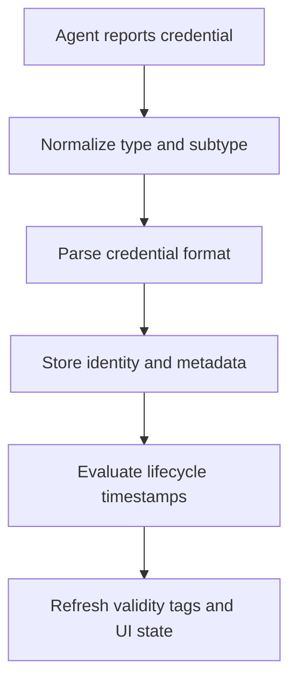

Agents can report one or more credentials in any `post_response` message.
Mythic 4.0 stores a credential type and subtype, parses supported formats, tracks structured identity and metadata, and automatically evaluates time-based validity.

## Agent response

```json
{
  "action": "post_response",
  "responses": [
    {
      "task_id": "agent-task-uuid",
      "credentials": [
        {
          "credential_type": "jwt",
          "credential_subtype": "access-token",
          "realm": "api.example.test",
          "account": "alice",
          "credential": "eyJhbGciOi...",
          "comment": "Token returned by the service",
          "custom_display": "alice API access token",
          "metadata": { // optional
            "issuer": "https://id.example.test",
            "not_before": "2026-07-31T18:00:00Z",
            "expires_at": "2026-07-31T19:00:00Z",
            "renew_until": "2026-08-07T19:00:00Z"
          },
          "credential_identity": { // optional
            "subject": "user-42",
            "email": "alice@example.test"
          }
        }
      ]
    }
  ]
}
```

`credential_type` is normalized to one of:

- `plaintext`
- `certificate`
- `hash`
- `key`
- `ticket`
- `cookie`
- `hex`
- `jwt`

Unknown types fall back to `plaintext`. `credential_subtype` is a normalized, free-form value that distinguishes formats within a type, such as a particular hash algorithm or token role.

Mythic requires at least an `account`, a `realm`, or a non-empty `credential_identity`. The remaining enrichment fields are optional:

- `comment` records operator-facing context.
- `custom_display` overrides the compact label used in the UI.
- `metadata` stores descriptive and lifecycle data.
- `credential_identity` stores stable structured identity fields.

Any additional keys supplied on the credential object are merged into `metadata` for compatibility.

## Parsing and validity

Mythic includes parsers for structured formats such as JWT and Kerberos credentials.
A parser can populate the subtype, identity, account, realm, and metadata from the credential value.
Explicit structured values are preserved where appropriate.

Lifecycle metadata uses RFC 3339 timestamps:

```json
{
  "not_before": "2026-07-31T18:00:00Z",
  "expires_at": "2026-07-31T19:00:00Z",
  "renew_until": "2026-08-07T19:00:00Z"
}
```

Mythic calculates a `validity` object inside the stored metadata and maintains operation tags when the credential is not yet valid, expired, or past its renewal window.



When the same credential, type, subtype, identity, account, and realm are reported again in an operation, Mythic refreshes the existing record instead of creating a duplicate.

See [Credentials](/version-4.0/operational-pieces/credentials) for operator workflows and [Tasking References](/version-4.0/operational-pieces/understanding-commands/tasking-references) for using `@cred` references in task arguments.
