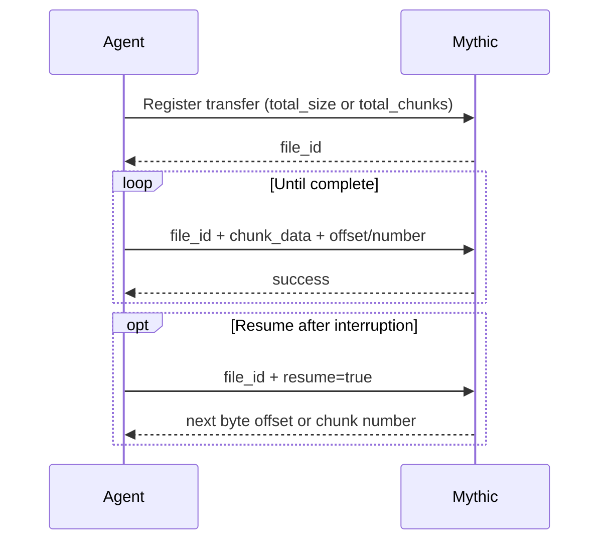

An agent downloads a file by asking Mythic for a `file_id` to track the new file, and then posting file data against that ID.
Mythic 4.0 supports two mutually exclusive transfer modes:

- **Offset mode** uses `total_size` and zero-based `chunk_offset`.
- **Chunk mode** uses `total_chunks`, `chunk_size`, and one-based `chunk_num` for compatibility with existing agents.

Do not mix `total_size` with `total_chunks`, or `chunk_offset` with `chunk_num`, in the same transfer.



## Offset mode

Register the file with its byte length. Optional metadata can be supplied during registration or a later data message.
A negative `total_size` can be updated later when the final size becomes known.

```json
{
  "action": "post_response",
  "responses": [
    {
      "task_id": "agent-task-uuid",
      "download": {
        "total_size": 1048576,
        "full_path": "/var/tmp/archive.bin",
        "host": "WORKSTATION-7",
        "filename": "archive.bin",
        "is_screenshot": false
      }
    }
  ]
}
```

Mythic returns the registered file UUID:

```json
{
  "action": "post_response",
  "responses": [
    {
      "status": "success",
      "file_id": "4b60bd75-bcf4-4c3e-8abe-9566c23b8cb8",
      "task_id": "agent-task-uuid"
    }
  ]
}
```

Send each base64-encoded block with its zero-based position in the file. Blocks can arrive out of order and do not need a fixed size.

```json
{
  "action": "post_response",
  "responses": [
    {
      "task_id": "agent-task-uuid",
      "download": {
        "file_id": "4b60bd75-bcf4-4c3e-8abe-9566c23b8cb8",
        "chunk_offset": 0,
        "chunk_data": "AAECAwQFBgc="
      }
    }
  ]
}
```

Mythic marks the file complete after the received byte ranges cover `total_size`.

## Resume a transfer

To resume an existing file from a later task, send the prior `file_id` with `resume: true`.
Mythic returns the first contiguous byte offset that has not been received.

```json
{
  "action": "post_response",
  "responses": [
    {
      "task_id": "new-agent-task-uuid",
      "download": {
        "file_id": "4b60bd75-bcf4-4c3e-8abe-9566c23b8cb8",
        "resume": true
      }
    }
  ]
}
```

```json
{
  "action": "post_response",
  "responses": [
    {
      "status": "success",
      "task_id": "new-agent-task-uuid",
      "file_id": "4b60bd75-bcf4-4c3e-8abe-9566c23b8cb8",
      "total_size": 1048576,
      "chunk_offset": 524288,
      "transfer_type": "offset"
    }
  ]
}
```

Continue sending data from the returned `chunk_offset`.
For a numbered transfer, the same resume request returns `total_chunks`, `chunk_size`, and the next one-based `chunk_num` instead.

## Numbered chunk compatibility

Existing agents can continue registering with `total_chunks` and an optional fixed `chunk_size`:

```json
{
  "action": "post_response",
  "responses": [
    {
      "task_id": "agent-task-uuid",
      "download": {
        "total_chunks": 4,
        "chunk_size": 512000,
        "full_path": "/var/tmp/archive.bin"
      }
    }
  ]
}
```

Data messages use one-based `chunk_num`:

```json
{
  "action": "post_response",
  "responses": [
    {
      "task_id": "agent-task-uuid",
      "download": {
        "file_id": "4b60bd75-bcf4-4c3e-8abe-9566c23b8cb8",
        "chunk_num": 1,
        "chunk_size": 512000,
        "chunk_data": "AAECAwQFBgc="
      }
    }
  ]
}
```

If chunks may arrive out of order, provide the fixed `chunk_size` during registration or on the first chunk.
`chunk_size` is the normal block size, not necessarily the length of the final block.
A negative `total_chunks` can be updated later when the final count becomes known.

## Common fields

- `full_path` records the remote path and helps Mythic update the file browser.
- `host` defaults to the callback host when omitted.
- `filename` supplies a display name when no meaningful remote path exists.
- `is_screenshot` routes the completed file to screenshot views; it defaults to `false`.
- Additional keys are echoed in Mythic's response, which can be useful for an agent-local correlation ID.

See [File Download Message Flow](/version-4.0/message-flow/file-download-agent-greater-than-mythic) for the end-to-end flow and [Action: post_response](/version-4.0/customizing/payload-type-development/create_tasking/agent-side-coding/action-post_response) for the surrounding agent message.
