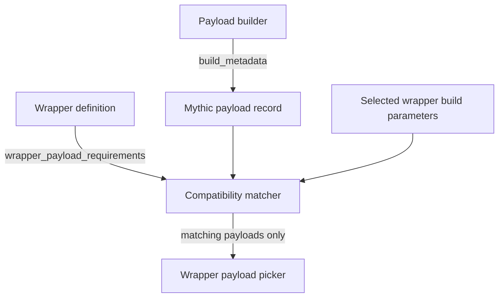

Mythic 4.0 replaces wrapper payload type allowlists with metadata-driven compatibility.
A normal payload builder reports what it produced; a wrapper declares the exact OS, architecture, and format combinations it accepts.



## Report build metadata

Mythic records the selected OS. The builder returns the resulting architecture and file format.

<CodeGroup>
```python Python
from mythic_container.PayloadBuilder import (
    BuildResponse,
    BuildStatus,
    PayloadBuildMetadata,
    PayloadBuildMetadataArchitecture,
    PayloadBuildMetadataFormat,
)

return BuildResponse(
    status=BuildStatus.Success,
    payload=payload_bytes,
    build_metadata=PayloadBuildMetadata(
        architecture=PayloadBuildMetadataArchitecture.X64,
        format=PayloadBuildMetadataFormat.Shellcode,
    ),
)
```

```go Go
return agentstructs.PayloadBuildResponse{
    Success: true,
    Payload: &payloadBytes,
    BuildMetadata: &agentstructs.PayloadBuildMetadata{
        Architecture: agentstructs.PAYLOAD_BUILD_ARCHITECTURE_X64,
        Format:       agentstructs.PAYLOAD_BUILD_FORMAT_SHELLCODE,
    },
}
```
</CodeGroup>

Common architecture values are `x86`, `x64`, `arm`, and `arm64`. Common formats are `exe`, `dll`, `shellcode`, `macho`, `elf`, `so`, and `dylib`.

## Declare wrapper requirements

Multiple requirement rules are ORed. Every field in one `requires` object must match. `payload_type` is optional; omit it when any payload type with the required file metadata is acceptable.

Optional `when` conditions bind a rule to the wrapper's own build parameter values.

You can think of this like: _When_ my build parameter's are configured like X, I _require_ that the payload I'm trying to wrap have this configuration.

<CodeGroup>
```python Python
from mythic_container.PayloadBuilder import (
    PayloadType,
    WrapperPayloadRequirement,
    WrapperPayloadRequirementRequires,
    WrapperPayloadRequirementWhen,
)

class ServiceWrapper(PayloadType):
    name = "service_wrapper"
    wrapper = True
    wrapper_payload_requirements = [
        WrapperPayloadRequirement(
            when=[WrapperPayloadRequirementWhen("target_arch", "x64")],
            requires=WrapperPayloadRequirementRequires(
                os="Windows",
                architecture="x64",
                format="shellcode",
                payload_type="apollo",
            ),
        ),
        WrapperPayloadRequirement(
            when=[WrapperPayloadRequirementWhen("target_arch", "x86")],
            requires=WrapperPayloadRequirementRequires(
                os="Windows",
                architecture="x86",
                format="shellcode",
            ),
        ),
    ]
```

```go Go
WrapperPayloadRequirements: []agentstructs.WrapperPayloadRequirement{
    {
        When: agentstructs.WrapperPayloadRequirementWhenConditions{
            {BuildParameterName: "target_arch", BuildParameterValue: "x64"},
        },
        Requires: agentstructs.WrapperPayloadRequirementRequires{
            OS:           agentstructs.SUPPORTED_OS_WINDOWS,
            Architecture: agentstructs.PAYLOAD_BUILD_ARCHITECTURE_X64,
            Format:       agentstructs.PAYLOAD_BUILD_FORMAT_SHELLCODE,
            PayloadType:  "apollo",
        },
    },
},
```
</CodeGroup>

The resulting sync JSON is:

```json
{
  "wrapper_payload_requirements": [
    {
      "when": {"target_arch": "x64"},
      "requires": {
        "os": "Windows",
        "architecture": "x64",
        "format": "shellcode",
        "payload_type": "apollo"
      }
    }
  ]
}
```
