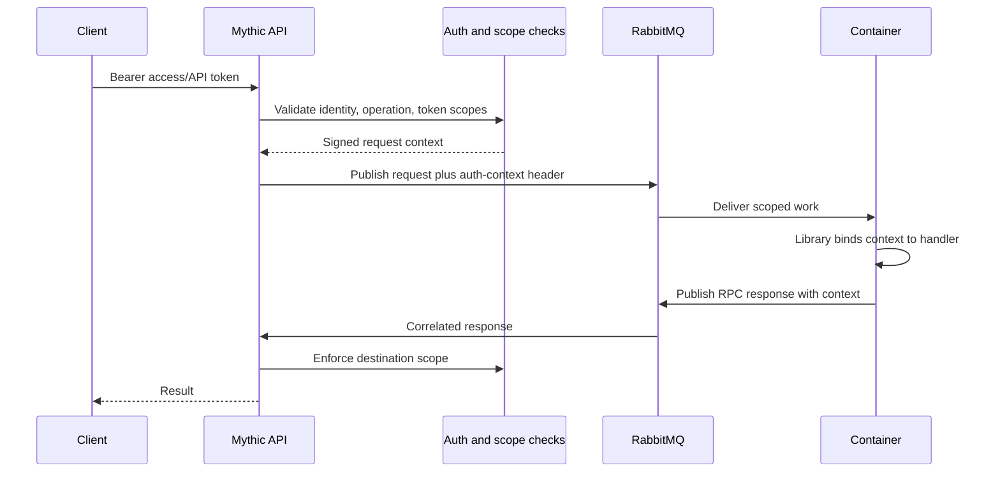

Mythic 4.0 carries authenticated context across container RPC.
This prevents a request from gaining authority merely because it moved from HTTP/GraphQL to RabbitMQ.

The context represents the initiating operator or bot, current operation, API-token/event-step attribution, and effective scopes.
Compatible Mythic container libraries propagate it automatically through built-in RPC helpers.

## Developer requirements

- Upgrade all container libraries before connecting them to v4.
- Pass the handler context to container-library RPC helpers instead of creating a detached background context.
- Preserve the Mythic auth-context RabbitMQ header in custom forwarding code.
- Choose `custom_rpc_timeout` for legitimate long-running custom RPC work instead of retrying the same non-idempotent request.

<Warning>
A missing or invalid context is an authentication failure, not a transient RabbitMQ failure.
Blind retries can duplicate work and will not add the missing authority.
</Warning>
