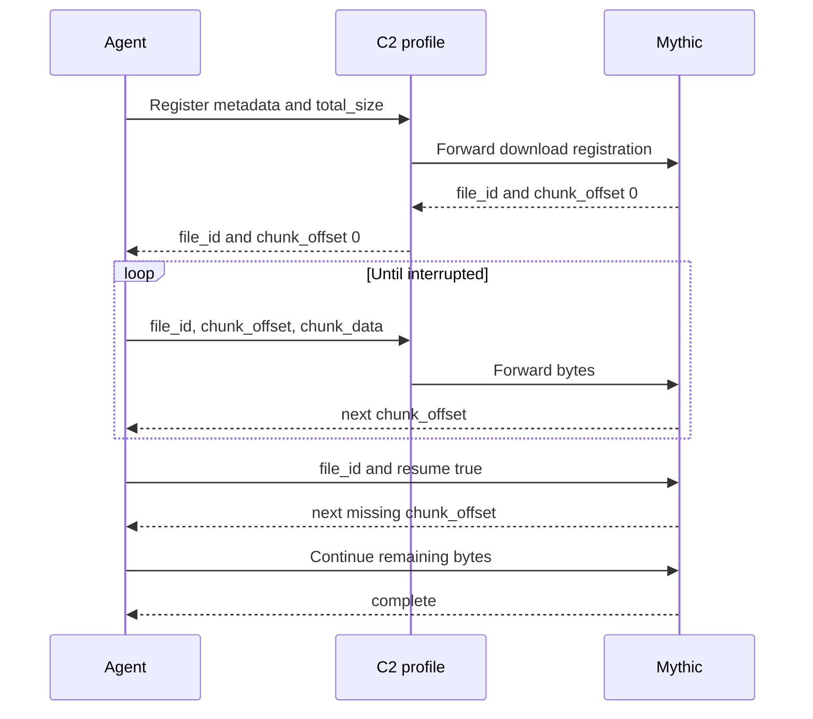

An agent-to-Mythic download is sent inside a normal agent response under the `download` keyword inside of the `responses` array.
Register the file first, keep the returned `file_id`, then send data with either numbered chunks or byte offsets.
One task can transfer multiple files concurrently because each transfer has its own UUID.

## Choose one transfer mode

| Mode | Registration fields | Data fields | Indexing |
| --- | --- | --- | --- |
| Numbered chunks | `total_chunks`, optionally `chunk_size` | `chunk_num`, `chunk_data` | `chunk_num` begins at 1 |
| Byte offsets | `total_size`, optionally `chunk_size` | `chunk_offset`, `chunk_data` | `chunk_offset` begins at 0 |

Do not send `chunk_num` and `chunk_offset` together. `chunk_data` is base64-encoded in the agent message.

## Register an offset transfer

```json
{
  "action": "post_response",
  "responses": [{
    "task_id": "task-uuid",
    "download": {
      "total_size": 10485760,
      "filename": "archive.zip",
      "full_path": "/tmp/archive.zip",
      "host": "workstation-01",
      "is_screenshot": false
    }
  }]
}
```

Mythic returns a response containing `file_id`.

## Send data

```json
{
  "action": "post_response",
  "responses": [{
    "task_id": "task-uuid",
    "download": {
      "file_id": "6f0e88d8-6f25-4de8-b9c4-4dcc4cf814f3",
      "chunk_offset": 0,
      "chunk_data": "BASE64_BYTES"
    }
  }]
}
```

Mythic returns the chunk_offset it just received with a success or error state.
Mythic tracks bytes received and marks the file complete when the registered size has arrived.

## Register a chunk transfer

```json
{
  "action": "post_response",
  "responses": [{
    "task_id": "task-uuid",
    "download": {
      "total_chunks": 12,
      "filename": "archive.zip",
      "full_path": "/tmp/archive.zip",
      "host": "workstation-01",
      "is_screenshot": false
    }
  }]
}
```

Mythic returns a response containing `file_id`.

## Send data

```json
{
  "action": "post_response",
  "responses": [{
    "task_id": "task-uuid",
    "download": {
      "file_id": "6f0e88d8-6f25-4de8-b9c4-4dcc4cf814f3",
      "chunk_num": 1,
      "chunk_data": "BASE64_BYTES"
    }
  }]
}
```

Mythic returns the chunk_num it just received with a success or error state.
Mythic tracks bytes received and marks the file complete when the registered size has arrived.

## Resume an interrupted transfer

After an interruption, register with the existing UUID and `resume: true`:

```json
{
  "action": "post_response",
  "responses": [{
    "task_id": "task-uuid",
    "download": {
      "file_id": "6f0e88d8-6f25-4de8-b9c4-4dcc4cf814f3",
      "resume": true
    }
  }]
}
```

For an offset transfer Mythic returns the next missing `chunk_offset`.
For a numbered transfer it returns the next missing `chunk_num` and the established `chunk_size`.
Continue from that value instead of restarting the file.



Use `full_path`, `filename`, `host`, and `is_screenshot` on registration so Mythic can index and render the file correctly.
The agent can update file metadata later through the normal response/RPC mechanisms.
