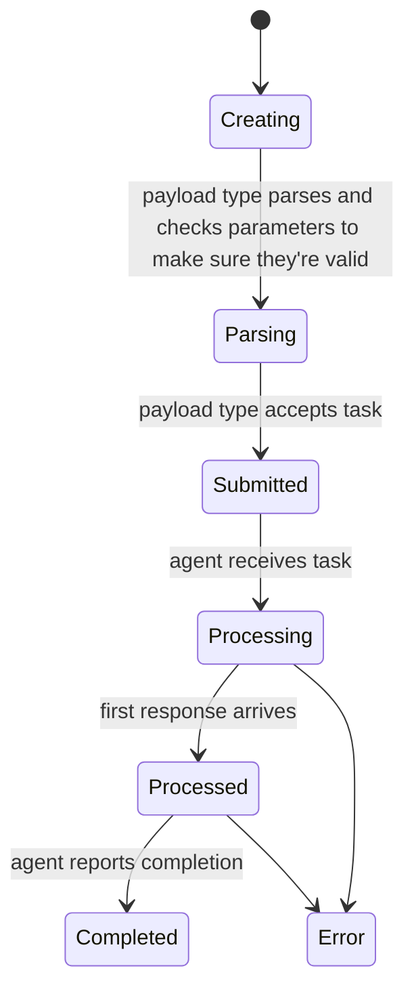

Open active callbacks with the phone icon.
The page combines a virtualized, resizable callback table with configurable tasking views, callback browsers, task output, and C2 path information.

## Callback table

Sort and filter the table, resize columns, or open a row's context menu. You can right click the table columns or the rows themselves to get a lot of options.
The operation-scoped callback number shown in the UI is its `display_id`; v4 public tasking actions generally call this `callback_display_id`.

Common fields include host, IP addresses, user, PID, operating system and architecture, integrity level, last check-in, description, payload, sleep information, and callback lock.
High-integrity callbacks are visually distinguished when the payload reports `integrity_level` greater than 2.

<Frame>
  
</Frame>

Row and bulk actions include:

- open a tasking view or the single-callback workspace
- edit the description and row color
- lock or unlock the callback
- open file, process, or custom browsers
- inspect callback, payload, C2, and graph metadata
- invoke an eventing workflow for one or more callbacks
- hide a callback or issue its payload type's exit command

Callback locks coordinate operators; they are not a substitute for operation permissions or API-token scopes.

## Tasking

Select a callback, type a command, and press `Tab` to complete command names, parameter names, and supported choices.
Use the arrow keys for history and `Ctrl+R` for reverse history search.
[Operator aliases](/version-4.0/operational-pieces/operator-aliases) can expand reusable command lines, while [task references](/version-4.0/operational-pieces/understanding-commands/tasking-references) can resolve `@cred` and `@link` values immediately before submission.

Tasks normally progress through these states:

The task header shows its operation-scoped display ID, issuing operator, command, display parameters, status, timestamps, comments, tags, and available actions.
Open the display ID to share a focused single-task view.

## Output views

Mythic 4.0 adds improved response streaming, pagination, filtering, completion tracking, and single-task navigation.
Plain output can switch among `plaintext`, formatted JSON, `Markdown`, and `xterm-based` terminal rendering.
Interactive commands use the terminal for keyboard input and ANSI output while Mythic continues to record responses and browser-originated input.

Browser scripts can still transform structured output into tables, media, graphs, and tabs.
Toggle the browser script per task when you need the raw response.
Commands that implement the [file-editor protocol](/version-4.0/operational-pieces/file-editor) display a versioned editor directly in the response area.

## Callback workspaces

Tasking views include the normal callback tab, expanded/split layouts, and console-like output.
Callback tabs can also expose file and process browsers and C2 path diagrams.
Use filters to reduce visible tasks without altering operation data.
