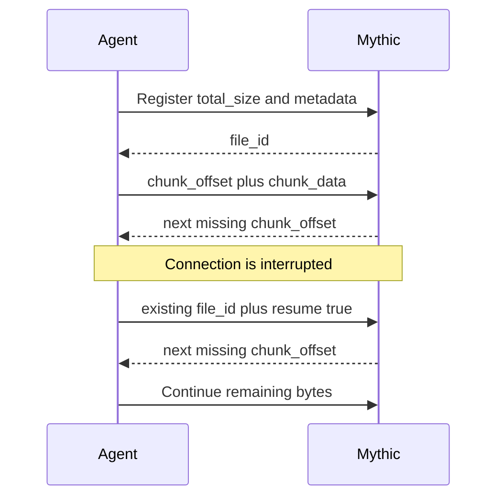

Use the paperclip icon on the left to quickly navigate to the file search.
Mythic associates each uploaded or downloaded file with its task, callback, host, operator, timestamps, remote path, hashes, and transfer state.

## Review files

Select a row to inspect its SHA-1 and MD5 hashes, size, bytes received, task comment, tags, and file metadata.
Preview supported files as media, text, hex, or a SQLite database without first saving them locally.
Authenticated previews and downloads use the current Bearer token in v4.

Select multiple completed downloads and choose **Zip & Download selected** to retrieve them as one archive.

<Frame>
  
</Frame>

## Transfer progress and resume

Mythic 4.0 supports the existing numbered-chunk protocol and a byte-offset protocol.
Offset transfers expose byte-level progress, and interrupted agent-to-Mythic downloads can resume from the next missing chunk or offset when the agent supplies the existing `file_id` with `resume: true`.

See [Agent → Mythic File Downloads](/version-4.0/message-flow/file-download-agent-greater-than-mythic) for wire examples.

## Edit text files

Commands that implement the v4 file-editor protocol can open a versioned UTF-8 document in the task response.
The editor supports refresh, save, staged previews, conflicts, force-overwrite, history, and close.
See [File Editor](/version-4.0/operational-pieces/file-editor).

C2 profiles can also track files hosted through the profile.
Operators can update, retry, stop, or remove a hosted file from the C2 profile workflow instead of treating hosting as an untracked side effect.

<Frame>
  
</Frame>