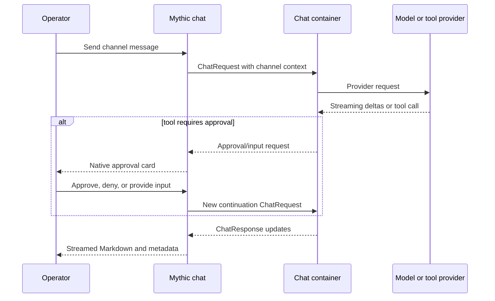

Mythic 4.0 separates operator conversation from the Event Feed.
Operation chat provides persistent channels for people and, when a chat container is installed, AI-backed channels that can stream responses and use tools.

## Channel types

- **Standard channels** are operator-to-operator conversations. Members of the operation can search history, edit or delete their own messages, and track unread state.
- **AI channels** are bound to an installed chat container and one of its advertised models. The channel stores model configuration separately from operator secrets.

Channels can be locked, muted, or archived. Locking prevents new messages while preserving history; archiving removes a channel from the active list without deleting its messages.

## AI-backed conversations

Depending on the selected chat container, an AI channel can provide:

- streamed Markdown responses with cancellation and retry;
- slash commands and clickable channel metadata;
- Mythic and MCP tool-use cards with lazily loaded full output;
- approval cards before a write-capable tool runs;
- typed operator-input requests with selectable choices;
- delegated sub-agent summaries and drill-down views.

<Warning>
Chat container configuration and secrets may grant access to external model providers or tools. Review the container, choose narrowly scoped API tokens, and treat approval prompts as security boundaries.
</Warning>

## API-token behavior

Mythic creates per-channel bot API tokens for AI channels and scopes them to the operation and requested capabilities. Tokens are opaque and are not recoverable after creation. Invalidating a channel's bot token prevents that container from continuing to act until a replacement is created.

For custom integrations, standard chat uses `chat.read`/`chat.write`; AI-backed chat uses `chat-ai.read`/`chat-ai.write`.

## Event Feed versus chat

Use the **Event Feed** for server events, warnings, and audit context. Use **Operation Chat** for conversation. Resolving an Event Feed warning does not alter chat history, and archiving a chat channel does not remove event records.
